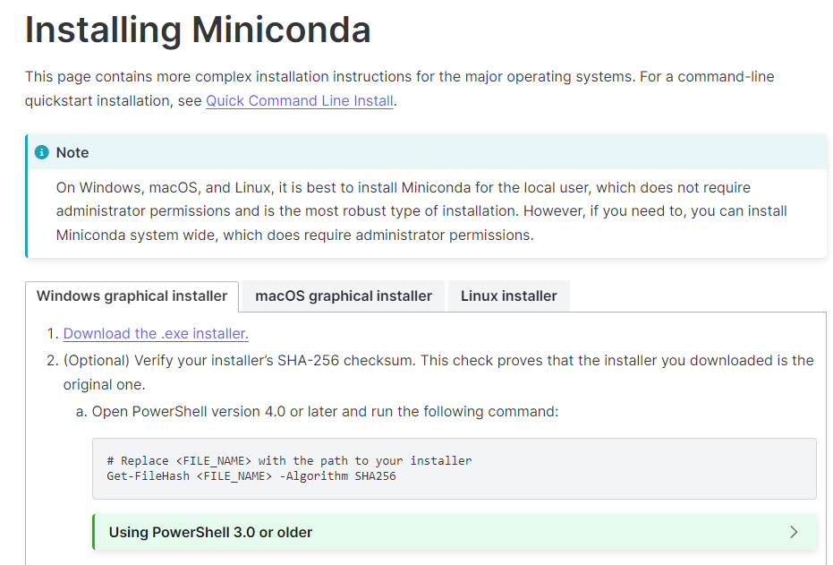
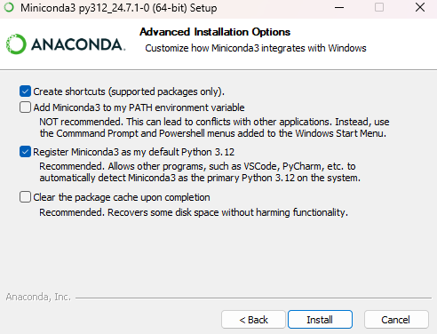
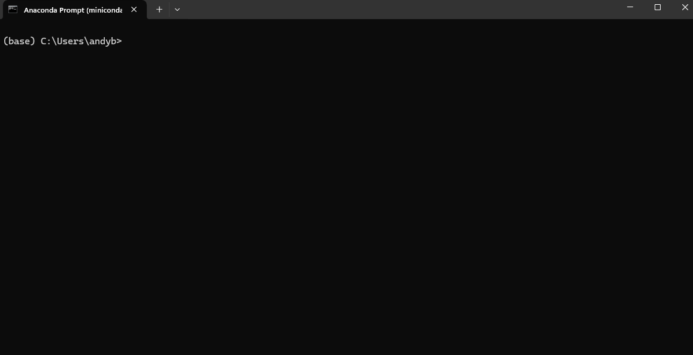
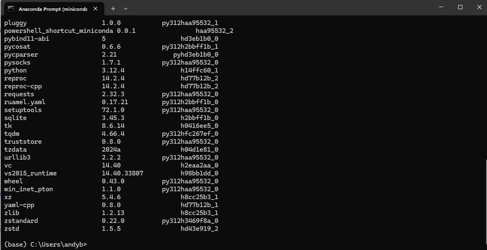
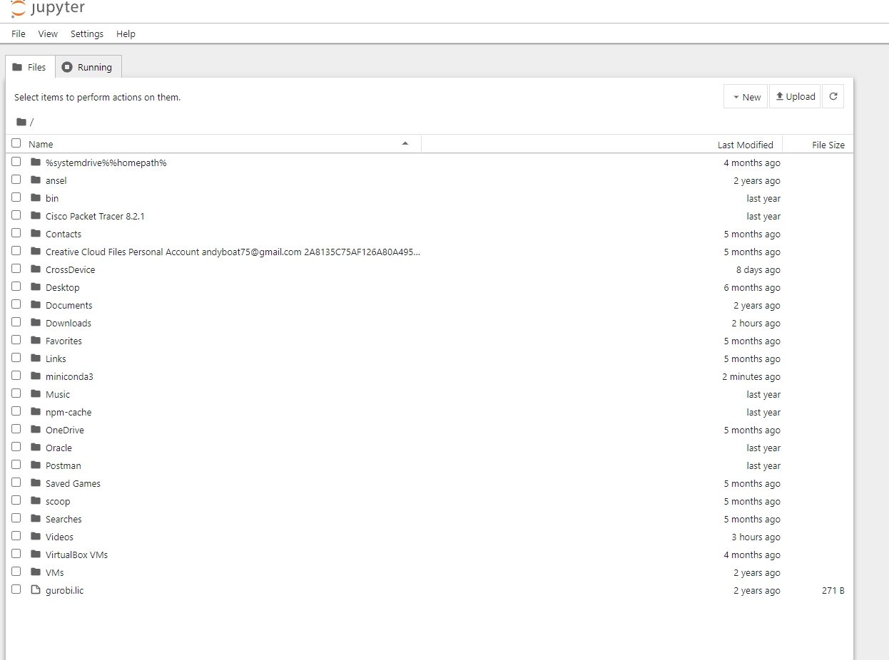

# Installation instruction for miniconda
Below is the steps to have a standalone python and python environment for this tutorials.

NB: This instructions are for windows 10 and above users

## Downloading Miniconda
- Go to [this page to download](https://docs.anaconda.com/miniconda/miniconda-install/) miniconda
- Click "Download the .exe installer"

## Installing Miniconda
- Open the installer and keep clicking next until you get get to the page below
- Make sure to select the exact same thing in the picture below

- Click Install
- De-select the two boxes and click finish

## Setting up
- Open start menu and type 'anaconda prompt'
- click it to open. It will look like the picture below

- Copy and paste the command below and press enter
'''bash
conda list
'''
- If you get the results as shown in the picture below then you have done well

- Copy and paste the command below and press enter. It will take some time so please wait for it to finish.
'''bash
conda install jupyter ipykernel --yes
'''
- Press the windows key and search 'jupyter notebook' and then open it.
- You should get something similar to the picture below
